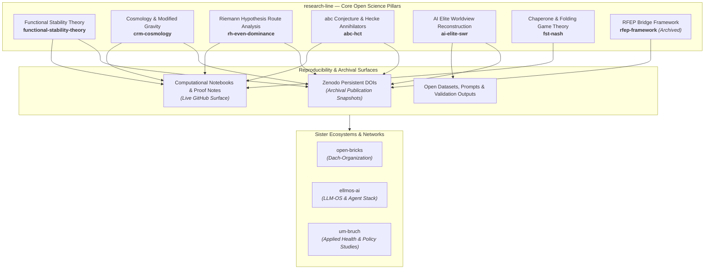

<!-- last-checked: 2026-09-20 -->
# research-line

  

  
  
  
  
  
  
  
  
  

<b>🇩🇪 <a href="README_de.md">Deutsche Version</a></b>

**Open-access research repositories with preprints, computational notebooks, proof notes, reproducible research data, and Zenodo DOI archival records.**

`research-line` collects public research work across mathematical physics (Functional Stability Theory), modified-gravity cosmology (Curvature Relaxation Model), conditional Riemann Hypothesis route analysis, number theory & Hecke quotient verification (HCT/abc conjecture), AI-society studies (Synthetic Worldview Reconstruction), and computational biology theory (FST-Nash chaperone dynamics). The repositories are intended for inspection, open science, peer review, citation, and follow-up research.

> [!NOTE]
> Machine-readable ecosystem context and repository mappings for AI agents and automated tools are available in **[llms.txt](https://github.com/research-line/.github/blob/main/llms.txt)**.
> Public index verified against live GitHub API: **2026-09-20**.

> [!IMPORTANT]
> **Open Science & Status Boundaries:** Repositories in this organization contain research code, proof audits, preprints, and computational notebooks. Archival snapshot DOIs are hosted on Zenodo. Always check individual repository READMEs and `CITATION.cff` files for specific status boundaries (established, conditional, exploratory, or archived). None of the materials constitute medical, legal, financial, or investment advice.

---

## Open Science Architecture

---

## Quick Navigation / Start Here

| Objective | Recommended Repository | Key Content & Context |
|---|---|---|
| **Broad Mathematical Physics Programme** | **[functional-stability-theory](https://github.com/research-line/functional-stability-theory)** | Main FST hub with domain proofs (NS, YM, TU, DE, Hodge, BSD, P-vs-NP), applications, and reproducibility surfaces |
| **Riemann Hypothesis Route Analysis** | **[rh-even-dominance](https://github.com/research-line/rh-even-dominance)** | Conditional RH route atlas with verification scripts, certificates, Zenodo records, and proof-audit boundaries |
| **abc Conjecture & Hecke Quotient Verification** | **[abc-hct](https://github.com/research-line/abc-hct)** | HCT abc research papers, proof notes, Manin symbol pairing engine over Hecke algebras, and reproducible no-Magma rank certificates |
| **Cosmology & Modified Gravity** | **[crm-cosmology](https://github.com/research-line/crm-cosmology)** | Curvature Relaxation Model papers and scripts for observational checks across CMB, Pantheon+, MOND, and SPARC |
| **AI Leadership Worldview Analysis** | **[ai-elite-swr](https://github.com/research-line/ai-elite-swr)** | Synthetic Worldview Reconstruction of AI elite statements, prompts, validation outputs, figures, and research data |
| **Protein Folding & Game Theory** | **[fst-nash](https://github.com/research-line/fst-nash)** | Potential-game diagnostics for chaperone systems and protein-folding regimes |
| **Historical RFEP Material** | **[rfep-framework](https://github.com/research-line/rfep-framework)** | Archived Renormalized Free-Energy Principle context and Zenodo-linked baseline material |

---

## Public Repository Directory

This index covers all 8 public `research-line` repositories visible on GitHub as of **2026-09-20**. Private or internal draft repositories are intentionally excluded from the public directory.

| Repository | Status | Domain | Public Role & Description |
|---|---|---|---|
| **[.github](https://github.com/research-line/.github)** | Active | Organization Profile | GitHub start page, default community-health files, and machine-readable `llms.txt` context |
| **[abc-hct](https://github.com/research-line/abc-hct)** | Active | Number Theory | HCT abc research papers, proof notes, Manin symbol pairings over Hecke algebras, and reproducible no-Magma Hecke quotient artifacts |
| **[ai-elite-swr](https://github.com/research-line/ai-elite-swr)** | Active | AI Society Research | Worldview reconstruction of public AI-leader statements with papers, prompts, validation outputs, figures, and reproducible data |
| **[crm-cosmology](https://github.com/research-line/crm-cosmology)** | Active | Cosmology | Curvature Relaxation Model papers and code for modified-gravity checks across CMB, Pantheon+, MOND, and SPARC contexts |
| **[fst-nash](https://github.com/research-line/fst-nash)** | Active | Computational Biology | Potential-game diagnostics for chaperone systems and protein-folding regimes |
| **[functional-stability-theory](https://github.com/research-line/functional-stability-theory)** | Active | Mathematical Physics | Functional Stability Theory programme material, domain proofs, applications, and reproducibility surfaces |
| **[rfep-framework](https://github.com/research-line/rfep-framework)** | Archived | Mathematical Physics | Earlier RFEP bridge material; retained for citation, baseline comparison, and historical context |
| **[rh-even-dominance](https://github.com/research-line/rh-even-dominance)** | Active | Number Theory | Conditional Riemann Hypothesis research atlas with scripts, certificates, Zenodo records, and proof-audit status boundaries |

---

## Related Um:bruch Applied Research

Several applied health policy, prescribing risk, and diagnostic projects live under [um-bruch](https://github.com/um-bruch) as part of the wider open-research network:

| Repository | Domain | Description |
|---|---|---|
| **[regressangst](https://github.com/um-bruch/regressangst)** | Health Policy | Public study package on prescribing risk, certification errors, and care provision patterns |
| **[verordnungsampel](https://github.com/um-bruch/verordnungsampel)** | Health Informatics | Research-use prescribing-rule inspection software for public German rule sets |
| **[multiaxial-diagnostic-system](https://github.com/um-bruch/multiaxial-diagnostic-system)** | Clinical Psychology | Multiaxial diagnostic framework for structured clinical assessment research |
| **[system-medicine](https://github.com/um-bruch/system-medicine)** | Systems Medicine | Knowledge-graph work for pathway-centric differential medical reasoning |
| **[locuterra](https://github.com/um-bruch/locuterra)** | Civic Tech / Commons | Public-interest location-based civic network demonstrator and local commons platform |

---

## Ecosystem & Sister Organizations

`research-line` operates within a broader open-source and open-science organization network anchored by **[open-bricks](https://github.com/open-bricks)**:

| Organization | Primary Domain | Focus & Specialization |
|---|---|---|
| **[open-bricks](https://github.com/open-bricks)** | Umbrella / Dach | Parent organization connecting all software products, tools, and research frameworks |
| **[ellmos-ai](https://github.com/ellmos-ai)** | LLM-OS / AI Infra | Agent operating systems (BACH, Rinnsal), memory pillar (.MEMORY, USMC, gardener), MCP servers |
| **[file-bricks](https://github.com/file-bricks)** | Desktop Utilities | Local-first PySide6 desktop file management, duplicate detection, and storage apps |
| **[doc-bricks](https://github.com/doc-bricks)** | Document Tools | Markdown tools, PDF processing, OCR engines, and document workflow software |
| **[dev-bricks](https://github.com/dev-bricks)** | Developer Tools | Developer utilities and IDEs (DevCenter, CodeBox, pythonbox, MethodenAnalyser, CareCenter) |
| **[research-line](https://github.com/research-line)** | Open Science | Open-access research in mathematical physics, cosmology, number theory, and AI society |
| **[biotec-line](https://github.com/biotec-line)** | Bioinformatics | Genomic variant tools, VCF processing, and clinical genetics software |
| **[entertain-and-more](https://github.com/entertain-and-more)** | Entertainment | Games with AI integration, interactive chess (ChatAndChess), and audio tools (KlangpultLight) |
| **[assistassets-ai](https://github.com/assistassets-ai)** | Financial AI | Local-first financial analysis, indicators, and assistant tools (FinancialProof) |
| **[um-bruch](https://github.com/um-bruch)** | Applied Health | Public health policy studies, prescribing risk analysis, and systems medicine |
| **[lukisch](https://github.com/lukisch)** | Personal / Core | Personal profile, core developer repositories, and cross-discipline integration |

---

## Current Public Activity Snapshot

Live activity verified via GitHub API on **2026-09-20**. Dates are the UTC day
of the API's `pushed_at` field, not a local-time conversion:

| Repository | Last Public Push | Focus & Navigation Purpose |
|---|---:|---|
| **[functional-stability-theory](https://github.com/research-line/functional-stability-theory)** | **2026-09-20** | Main hub for FST, domain proofs, mathematical-physics applications, and reproducibility material |
| **[crm-cosmology](https://github.com/research-line/crm-cosmology)** | **2026-09-19** | Curvature Relaxation Model papers and code for modified-gravity checks across CMB, Pantheon+, MOND, and SPARC |
| **[.github](https://github.com/research-line/.github)** | **2026-09-20** | Organization profile, community health files, and machine-readable `llms.txt` |
| **[abc-hct](https://github.com/research-line/abc-hct)** | **2026-09-19** | HCT abc research papers, proof notes, and reproducible no-Magma Hecke quotient rank certificates |
| **[rh-even-dominance](https://github.com/research-line/rh-even-dominance)** | **2026-09-19** | Conditional Riemann Hypothesis research atlas with scripts, certificates, Zenodo records, and proof-audit boundaries |
| **[fst-nash](https://github.com/research-line/fst-nash)** | **2026-08-20** | Potential-game diagnostics for chaperone systems and protein-folding regimes |
| **[ai-elite-swr](https://github.com/research-line/ai-elite-swr)** | **2026-08-05** | Synthetic Worldview Reconstruction of AI Elite worldviews: papers, prompts, validation outputs, figures, and data |
| **[rfep-framework](https://github.com/research-line/rfep-framework)** | **2026-03-19** | Earlier RFEP bridge material; retained for citation, baseline comparison, and historical context *(Archived)* |

---

## How To Read & Cite These Repositories

- **Current Status:** Prefer the repository `README.md` and `CITATION.cff` where present for official citation metadata and current status annotations.
- **Archival Records:** Treat Zenodo DOI records as archival publication snapshots, while GitHub hosts live code, ongoing updates, and proof-audit updates.
- **Search Terms:** Search by exact repository names such as `research-line/abc-hct`, `research-line/functional-stability-theory`, `research-line/crm-cosmology`, `research-line/rh-even-dominance`, `research-line/fst-nash`, or `research-line/ai-elite-swr`.
- **Key Discovery Phrases:** `research-line open-access research software`, `research-line Zenodo DOI reproducible research`, `research-line abc-hct`, `research-line abc conjecture Hecke quotient certificates`, `research-line Manin symbol pairing engine`, `research-line Functional Stability Theory`, `research-line FST domain proofs`, `research-line Curvature Relaxation Model CMB Pantheon MOND SPARC`, `research-line conditional Riemann Hypothesis proof audit`, `research-line AI elite worldview reconstruction`, `research-line chaperone systems FST-Nash`.
- **Machine Context:** Use [`research-line/.github/llms.txt`](https://github.com/research-line/.github/blob/main/llms.txt) for machine-readable ecosystem indexing.

---

<!-- last-checked: 2026-09-20 -->
