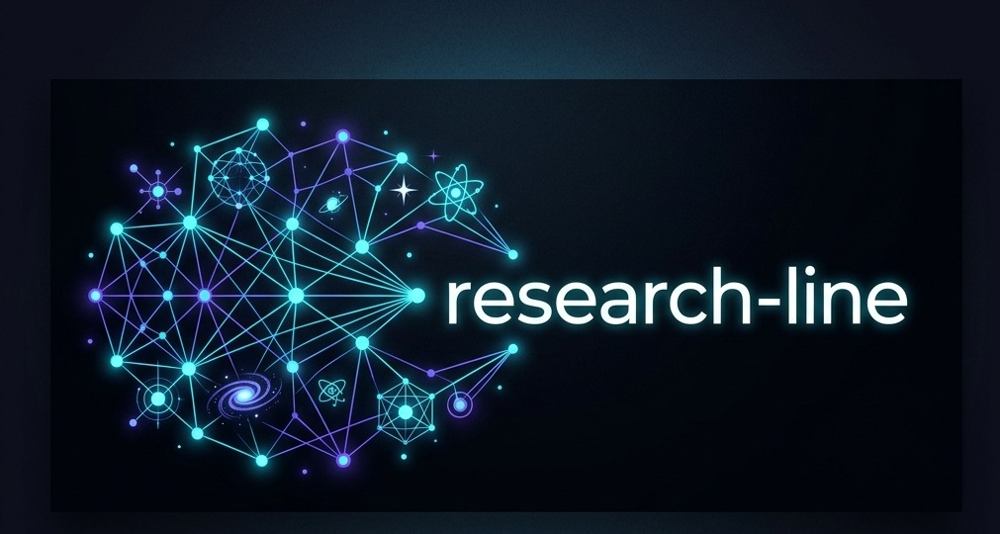
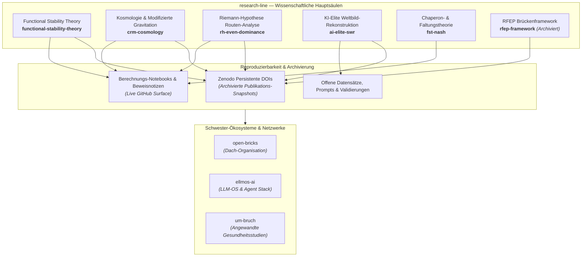

# research-line

  

  
  
  
  
  
  

<b>🇬🇧 <a href="README.md">English Version</a></b>

**Open-Access-Forschungsrepositories mit Preprints, mathematischen Beweisnotizen, Jupyter Notebooks, reproduzierbaren Forschungsdaten und Zenodo-DOI-Archivierung.**

`research-line` bündelt öffentliche wissenschaftliche Arbeiten aus der mathematischen Physik (Functional Stability Theory), der Kosmologie modifizierter Gravitation (Curvature Relaxation Model), der routenbezogenen Riemann-Hypothesen-Analyse, der KI-Gesellschaftsforschung (Synthetic Worldview Reconstruction) und der theoretischen Computerbiologie (FST-Nash Chaperon-Dynamiken). Alle Repositories dienen der Inspektion, der Open-Science-Prüfung, dem Peer Review, der Zitation und der weiterführenden Forschung.

> [!NOTE]
> Maschinenlesbarer Ökosystem-Kontext für KI-Agenten, Crawler und automatisierte Tools ist unter **[llms.txt](https://github.com/research-line/.github/blob/main/llms.txt)** verfügbar.
> Öffentlicher Index geprüft gegen live GitHub-API: **29.07.2026**.

> [!IMPORTANT]
> **Open Science & Statusgrenzen:** Die Repositories dieser Organisation enthalten Forschungscode, Beweisaudits, Preprints und Berechnungsnotebooks. Archivarische Snapshot-DOIs sind auf Zenodo hinterlegt. Bitte beachten Sie die repo-spezifischen `README.md`- und `CITATION.cff`-Dateien bezüglich des konkreten Status (etabliert, konditional, explorativ oder archiviert). Keine der Inhalten stellt medizinische, rechtliche oder finanzielle Beratung dar.

---

## Open-Science-Architektur

---

## Schnelleinstieg / Start-Empfehlung

| Forschungsziel | Empfohlenes Repository | Kerninhalte & Kontext |
|---|---|---|
| **Mathematisch-Physikalisches Programm** | **[functional-stability-theory](https://github.com/research-line/functional-stability-theory)** | Haupt-FST-Hub mit Domain-Beweisen (NS, YM, TU, DE, Hodge, BSD, P-vs-NP), Anwendungen & Reproduzierbarkeit |
| **Riemann-Hypothesen Routen-Atlas** | **[rh-even-dominance](https://github.com/research-line/rh-even-dominance)** | Konditionaler RH-Atlas mit Verifikations-Skripten, Zertifikaten, Zenodo-Einträgen & Beweisgrenzen |
| **Kosmologie & Modifizierte Gravitation** | **[crm-cosmology](https://github.com/research-line/crm-cosmology)** | Curvature Relaxation Model (CRM) Arbeiten & Skripte für Checks bezüglich CMB, Pantheon+, MOND & SPARC |
| **KI-Führungsriegen Weltbild-Analyse** | **[ai-elite-swr](https://github.com/research-line/ai-elite-swr)** | Synthetic Worldview Reconstruction öffentlicher KI-Aussagen mit Preprints, Prompts, Validierungs-Daten & Abbildungen |
| **Proteinfaltung & Spieltheorie** | **[fst-nash](https://github.com/research-line/fst-nash)** | Potentialspiel-Diagnostik für Chaperon-Systeme und Proteinfaltungs-Regime |
| **Historisches RFEP-Material** | **[rfep-framework](https://github.com/research-line/rfep-framework)** | Archivierte Grundlagen des Renormalized Free-Energy Principles mit Zenodo-Verlinkung |

---

## Öffentliches Repository-Verzeichnis

Dieser Index umfasst alle 7 öffentlichen Repositories von `research-line` (Stand: **29.07.2026**). Private oder interne Entwicklungs-Repositories sind im öffentlichen Verzeichnis bewusst ausgeschlossen.

| Repository | Status | Fachbereich | Rolle & Beschreibung |
|---|---|---|---|
| **[.github](https://github.com/research-line/.github)** | Aktiv | Organisationsprofil | GitHub-Startseite, Standard-Community-Dateien und maschinenlesbarer `llms.txt`-Kontext |
| **[ai-elite-swr](https://github.com/research-line/ai-elite-swr)** | Aktiv | KI-Gesellschaftsforschung | Rekonstruktion von Weltbildern führender KI-Akteure mit Arbeiten, Prompts, Validierungen & reproduzierbaren Daten |
| **[crm-cosmology](https://github.com/research-line/crm-cosmology)** | Aktiv | Kosmologie | Curvature Relaxation Model Arbeiten und Code für modifizierte Gravitationsprüfungen |
| **[fst-nash](https://github.com/research-line/fst-nash)** | Aktiv | Computerbiologie-Theorie | Potentialspiel-Diagnostik für Chaperon-Systeme und Proteinfaltungs-Regime |
| **[functional-stability-theory](https://github.com/research-line/functional-stability-theory)** | Aktiv | Mathematische Physik | Functional Stability Theory Programmmaterial, Domain-Beweise und Reproduzierbarkeitsflächen |
| **[rfep-framework](https://github.com/research-line/rfep-framework)** | Archiviert | Mathematische Physik | Früheres RFEP-Brückenmaterial; aufbewahrt für Zitationen, Vergleiche und Historie |
| **[rh-even-dominance](https://github.com/research-line/rh-even-dominance)** | Aktiv | Zahlentheorie | Konditionaler Riemann-Hypothesen-Atlas mit Skripten, Zertifikaten, Zenodo-Einträgen & Beweisgrenzen |

---

## Verwandte angewandte Forschung (Um:bruch)

Einige angewandte Gesundheitspolitik-, Verordnungsrisiko- und Diagnostikprojekte werden unter [um-bruch](https://github.com/um-bruch) gepflegt:

| Repository | Fachbereich | Beschreibung |
|---|---|---|
| **[regressangst](https://github.com/um-bruch/regressangst)** | Gesundheitspolitik | Öffentliches Studienpaket zu Verordnungsrisiken, Prüfanträgen und Versorgungsmustern |
| **[verordnungsampel](https://github.com/um-bruch/verordnungsampel)** | Gesundheitsinformatik | Software zur automatischen Prüfung deutscher Verordnungs- und Arzneimittelregeln |
| **[multiaxial-diagnostic-system](https://github.com/um-bruch/multiaxial-diagnostic-system)** | Klinische Psychologie | Multiaxiales Diagnostiksystem für strukturierte klinische Diagnostikforschung |
| **[system-medicine](https://github.com/um-bruch/system-medicine)** | Systemmedizin | Wissensgraph-Entwicklung für pfadzentrierte differentialmedizinische Logik |

---

## Ökosystem & Schwester-Organisationen

`research-line` ist Teil eines übergreifenden Open-Source-Netzwerks unter dem Dach von **[open-bricks](https://github.com/open-bricks)**:

| Organisation | Hauptbereich | Spezialisierung & Fokus |
|---|---|---|
| **[open-bricks](https://github.com/open-bricks)** | Dachorganisation | Dachstruktur für alle Softwareprodukte, Tools und Forschungsframeworks |
| **[ellmos-ai](https://github.com/ellmos-ai)** | LLM-OS / KI-Infra | Agenten-Betriebssysteme (BACH, Rinnsal), Speicher-Säule (.MEMORY, USMC, gardener), MCP-Server |
| **[file-bricks](https://github.com/file-bricks)** | Desktop-Tools | Local-First PySide6 Desktop-Dateiverwaltungs-, Dubletten- und Speicher-Apps |
| **[doc-bricks](https://github.com/doc-bricks)** | Dokumenten-Tools | Markdown-Tools, PDF-Verarbeitung, OCR-Engines und Dokumenten-Workflows |
| **[dev-bricks](https://github.com/dev-bricks)** | Entwickler-Tools | Entwicklerwerkzeuge und Cross-Agent-Infrastruktur (lock-master, ticket-master, sync-master) |
| **[research-line](https://github.com/research-line)** | Open Science | Open-Access-Forschung in mathematischer Physik, Kosmologie, Zahlentheorie & KI-Gesellschaft |
| **[biotec-line](https://github.com/biotec-line)** | Bioinformatik | Genomische Varianten-Tools, VCF-Verarbeitung und klinische Genetik |
| **[entertain-and-more](https://github.com/entertain-and-more)** | Entertainment | Spiele mit KI-Integration, interaktives Schach (ChatAndChess) und Podcast-Tools |
| **[assistassets-ai](https://github.com/assistassets-ai)** | Finanz-KI | Local-First Finanzanalysen, Indikatoren und Assistenz-Tools (FinancialProof) |
| **[um-bruch](https://github.com/um-bruch)** | Angewandte Gesundheit | Studien zur Versorgungssicherheit, Verordnungsampel und Systemmedizin |

---

## Aktueller Aktivitäts-Snapshot

Verifizierte Stand-Metadaten via GitHub-API am **29.07.2026**:

| Repository | Letzter Push | Ausrichtung & Navigation |
|---|---:|---|
| **[.github](https://github.com/research-line/.github)** | **29.07.2026** | Organisationsprofil, Community-Dateien & maschinenlesbares `llms.txt` |
| **[crm-cosmology](https://github.com/research-line/crm-cosmology)** | **27.07.2026** | Curvature Relaxation Model Arbeiten & Code für modifizierte Gravitationsprüfungen |
| **[fst-nash](https://github.com/research-line/fst-nash)** | **27.07.2026** | Potentialspiel-Diagnostik für Chaperon-Systeme und Proteinfaltungs-Regime |
| **[ai-elite-swr](https://github.com/research-line/ai-elite-swr)** | **27.07.2026** | KI-Elite Weltbild-Rekonstruktion: Preprints, Prompts, Validierungs-Daten & Abbildungen |
| **[rh-even-dominance](https://github.com/research-line/rh-even-dominance)** | **27.07.2026** | Konditionaler Riemann-Hypothesen-Atlas mit Skripten, Zertifikaten & Zenodo-Einträgen |
| **[functional-stability-theory](https://github.com/research-line/functional-stability-theory)** | **27.07.2026** | Haupt-FST-Hub für Domain-Beweise, Anwendungen & Reproduzierbarkeitsflächen |

---

<!-- last-checked: 2026-07-29 -->
